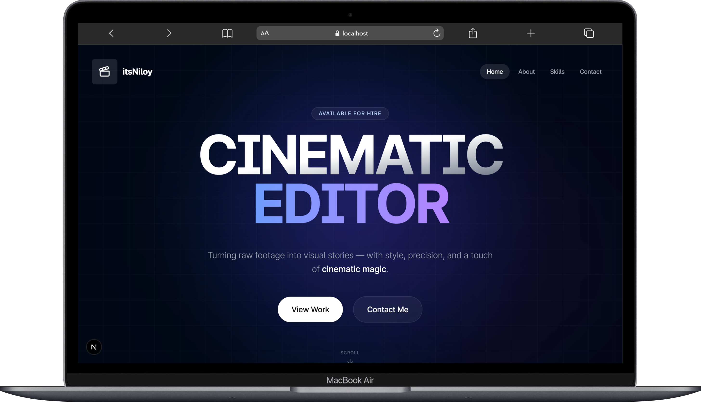

# Niloy Bhowmick

<div align="center">



### Midnight Liquid Glass Portfolio
*A premium, responsive video editing portfolio built with modern web technologies.*

[](https://nextjs.org/)
[](https://www.typescriptlang.org/)
[](https://tailwindcss.com/)
[](https://www.framer.com/motion/)

[**🌐 Live Website**](https://www.itsniloy.me)

</div>

## ✨ Design Philosophy: Midnight Liquid Glass

This project implements a unique **"Midnight Liquid Glass"** aesthetic, focusing on deep blacks, neon accents, and organic fluidity.

-   **Frosted Glass 2.0**: Premium `backdrop-blur-3xl` with milky-white tint for distinct separation.
-   **Unified Liquid Navigation**: A shapeshifting navbar that fluidly expands to contain mobile menus.
-   **Dynamic Interactions**: Mouse-following gradients and spotlight effects.
-   **YouTube Integration**: Custom light-weight players with high-quality playback enforcement.

## 🚀 Getting Started

### Prerequisites

- Node.js 22+
- pnpm package manager

### Installation

1.  **Clone the repository**
    ```bash
    git clone https://github.com/maruf-pfc/niloy-bhowmick.git
    cd niloy-bhowmick
    ```

2.  **Install dependencies**
    ```bash
    pnpm install
    ```

3.  **Set up environment variables**
    ```bash
    cp .env.example .env
    ```
    Add your environment variables:
    ```env
    RESEND_API_KEY=your_resend_api_key_here
    NEXT_PUBLIC_SITE_URL=https://www.itsniloy.me
    ```

4.  **Run the development server**
    ```bash
    pnpm dev
    ```

5.  **Open your browser**
    Navigate to [http://localhost:3000](http://localhost:3000)

### Building for Production

```bash
pnpm build
pnpm start
```

## 🚀 Deployment

### Vercel (Recommended)

1.  Push code to GitHub.
2.  Connect repository to Vercel.
3.  Add environment variables in Vercel dashboard:
    ```env
    RESEND_API_KEY=your_production_resend_key
    NEXT_PUBLIC_SITE_URL=https://www.itsniloy.me
    ```
4.  Deploy automatically.

### Other Platforms
-   **Netlify**: Static site deployment with form handling.
-   **AWS Amplify**: Full-stack deployment with API integration.
-   **GitHub Pages**: Static deployment (limited functionality).

## 📂 Project Structure

```plaintext
📦niloy-bhowmick
 ┣ 📂public
 ┃ ┣ 📂companies
 ┃ ┣ 📂project-images
 ┃ ┣ 📂tools
 ┃ ┣ 📜demo.png
 ┃ ┣ 📜logo-transparent.png
 ┃ ┣ 📜logo-white.png
 ┃ ┣ 📜niloybhowmick.png
 ┃ ┗ 📜not-found.jpg
 ┣ 📂src
 ┃ ┣ 📂app
 ┃ ┃ ┣ 📂_services
 ┃ ┃ ┣ 📂about
 ┃ ┃ ┣ 📂api
 ┃ ┃ ┃ ┗ 📂send-email
 ┃ ┃ ┣ 📂contact
 ┃ ┃ ┣ 📂project
 ┃ ┃ ┣ 📂skills
 ┃ ┃ ┣ 📜favicon.ico
 ┃ ┃ ┣ 📜globals.css
 ┃ ┃ ┣ 📜layout.tsx
 ┃ ┃ ┣ 📜loading.tsx
 ┃ ┃ ┣ 📜not-found.tsx
 ┃ ┃ ┗ 📜page.tsx
 ┃ ┣ 📂components
 ┃ ┃ ┣ 📂animate-ui
 ┃ ┃ ┣ 📂ui
 ┃ ┃ ┣ 📜CTASection.tsx
 ┃ ┃ ┣ 📜email-template.tsx
 ┃ ┃ ┣ 📜footer.tsx
 ┃ ┃ ┣ 📜glassmorphism-card.tsx
 ┃ ┃ ┣ 📜intro-animation.tsx
 ┃ ┃ ┣ 📜jump-to-top.tsx
 ┃ ┃ ┣ 📜mouse-move-effect.tsx
 ┃ ┃ ┣ 📜navbar.tsx
 ┃ ┃ ┗ 📜theme-provider.tsx
 ┃ ┣ 📂db
 ┃ ┃ ┣ 📜categories.ts
 ┃ ┃ ┣ 📜clients.ts
 ┃ ┃ ┣ 📜data.ts
 ┃ ┃ ┗ 📜skills.ts
 ┃ ┣ 📂hooks
 ┃ ┃ ┗ 📜use-mobile.tsx
 ┃ ┣ 📂lib
 ┃ ┃ ┣ 📜helper.ts
 ┃ ┃ ┗ 📜utils.ts
 ┃ ┣ 📂styles
 ┃ ┗ 📂types
 ┃ ┃ ┣ 📜cta.ts
 ┃ ┃ ┗ 📜videos.ts
 ┣ 📜.dockerignore
 ┣ 📜.env
 ┣ 📜.gitignore
 ┣ 📜Dockerfile
 ┣ 📜LICENSE
 ┣ 📜README.md
 ┣ 📜components.json
 ┣ 📜eslint.config.mjs
 ┣ 📜next-env.d.ts
 ┣ 📜next.config.ts
 ┣ 📜package.json
 ┣ 📜pnpm-lock.yaml
 ┣ 📜postcss.config.mjs
 ┗ 📜tsconfig.json
```

### 📝 Adding New Video Projects

To add a new project, simply edit `src/lib/data.ts`. No new code required!

```typescript
export const videoProjectsData = {
  "Talking Head": [
    {
      id: "unique-video-id",
      video_title: "Your Video Title",
      video_description: "Detailed description...",
      tags: ["Tag1", "Tag2"],
      cover_image: "youtube-video-id",
      publish_date: "2024-01-01",
      client_name: "Client Name",
      client_image: "/companies/client-logo.png",
      client_feedback: "Client testimonial...",
      video_link: "https://youtu.be/video-id",
      project_images: ["/path/to/image1.jpg"],
      category: "Talking Head",
      duration: "5:30",
      software_used: ["DaVinci Resolve", "After Effects"],
    },
  ],
};
```

## 🛠️ Tech Stack

-   **Core**: Next.js 15, TypeScript
-   **Styling**: Tailwind CSS, Shadcn/ui
-   **Animation**: Framer Motion
-   **Backend**: Resend (Email), Server Actions

---

<div align="center">

## Star History

[](https://star-history.com/#maruf-pfc/niloy-bhowmick&Date)

</div>
